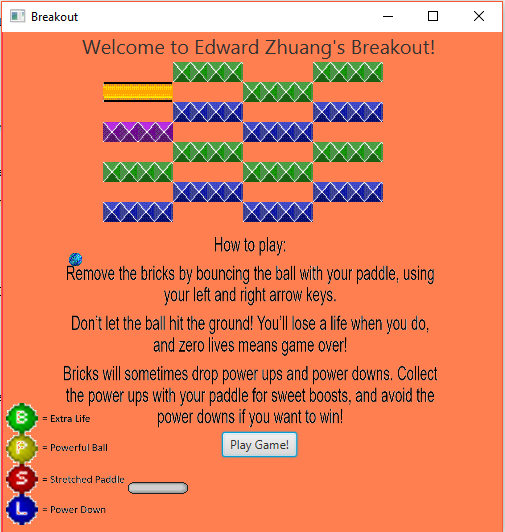

This is a breakout game with several levels, power ups, and block types. Enjoy!

All images used for the game can be found within the images folder. The level files are three text files (bricklist1, bricklist2, and bricklist3), and you can easily add additional level files. 

There are some cheat codes that can be used during the game.
L -> grants you another life. 
1, 2, 3 -> takes you to that specific level.
Q, W -> slows down the ball/speeds up the ball.
A -> enables for vertical movement of the paddle. 
B -> makes the next ball a powerful ball (goes through any brick).
P -> freezes the ball until paddle is moved.

